# 02 - MapReduce

## Objectif

Dans cette partie, j'utilise MapReduce pour répondre à deux questions :

- quelles villes commandent le plus d'articles ?
- quelle combinaison ville#année commande le plus d'articles ?

Le fichier utilisé est celui qui a été déposé dans HDFS :

```text
/user/root/tp_hadoop/input/dataw_fro03.csv
```

Les colonnes principales utilisées sont :

```text
villecli - ville du client
datcde   - date de la commande
qte      - quantité commandée
```

---

# Q1 - Quelles villes commandent le plus d'articles ?

Pour cette première question, le but est d'additionner les quantités `qte` pour chaque ville.

J'ai créé le dossier suivant :

```text
src/mapreduce/q1_ville/
```

avec :

```text
mapper.py
reducer.py
job.sh
```

---

## 1. Mapper

Le mapper récupère la ville et la quantité de chaque ligne.

```python
import sys
import csv

# On lit le fichier CSV ligne par ligne depuis l'entrée standard
reader = csv.reader(sys.stdin)

for row in reader:
    # On ignore les lignes trop courtes et l'en-tête du CSV
    if len(row) < 16 or row[0] == "codcli":
        continue

    # villecli est la colonne d'index 5
    ville = row[5]

    try:
        # qte est la colonne d'index 15
        # On convertit la valeur en entier pour pouvoir l'additionner ensuite
        qte = int(float(row[15]))
    except ValueError:
        # Si la quantité n'est pas valide, on ignore la ligne
        continue

    # Le mapper envoie : ville + quantité
    print(f"{ville}\t{qte}")
```

La sortie du mapper est donc de la forme :

```text
LE MANS    2
LE MANS    1
CAEN       3
```

---

## 2. Reducer

Le reducer reçoit les données triées par ville et additionne les quantités.

```python
import sys

# On garde en mémoire la ville en cours
current_ville = None

# Total des quantités pour cette ville
total = 0

for line in sys.stdin:
    line = line.strip()

    # On ignore les lignes vides
    if not line:
        continue

    try:
        # Chaque ligne reçue contient : ville + quantité
        ville, qte = line.split("\t", 1)
        qte = int(qte)
    except ValueError:
        continue

    # Si on est toujours sur la même ville, on ajoute la quantité
    if ville == current_ville:
        total += qte

    else:
        # Quand la ville change, on affiche le total de la ville précédente
        if current_ville is not None:
            print(f"{current_ville}\t{total}")

        # On commence ensuite le calcul pour la nouvelle ville
        current_ville = ville
        total = qte

# Il faut aussi afficher la dernière ville après la boucle
if current_ville is not None:
    print(f"{current_ville}\t{total}")
```

---

## 3. Test local

Avant de lancer le job sur Hadoop, j'ai testé le mapper et le reducer localement.

Depuis la racine du projet :

```powershell
Get-Content .\data\raw\dataw_fro03.csv | python .\src\mapreduce\q1_ville\mapper.py | Sort-Object | python .\src\mapreduce\q1_ville\reducer.py
```

Le `Sort-Object` remplace ici le Shuffle / Sort qui sera réalisé automatiquement par Hadoop sur le cluster.

Le test local fonctionne correctement.

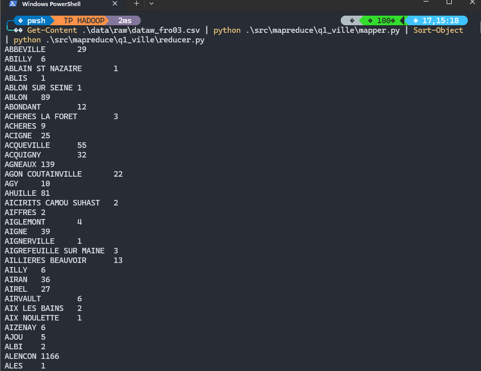

---

## 4. Lancement sur Hadoop

Les scripts ont ensuite été copiés dans le master :

```powershell
docker cp .\src\mapreduce\q1_ville\mapper.py hadoop-master:/home/mapper_q1.py
docker cp .\src\mapreduce\q1_ville\reducer.py hadoop-master:/home/reducer_q1.py
```

Puis j'ai lancé le job Hadoop Streaming :

```bash
hadoop jar $HADOOP_HOME/share/hadoop/tools/lib/hadoop-streaming-*.jar \
-file /home/mapper_q1.py -mapper "python3 mapper_q1.py" \
-file /home/reducer_q1.py -reducer "python3 reducer_q1.py" \
-input /user/root/tp_hadoop/input/dataw_fro03.csv \
-output /user/root/tp_hadoop/output/q1_ville
```

Le job arrive bien à :

```text
map 100%
reduce 100%
```

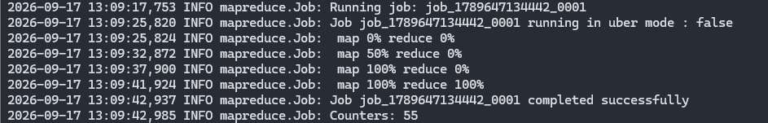

---

## 5. Vérification de la sortie

J'ai vérifié les fichiers créés dans HDFS :

```bash
hdfs dfs -ls /user/root/tp_hadoop/output/q1_ville
```

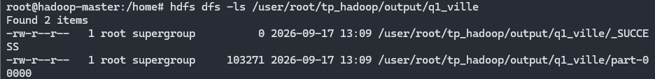

Puis j'ai affiché les premières lignes :

```bash
hdfs dfs -cat /user/root/tp_hadoop/output/q1_ville/part-* | head
```

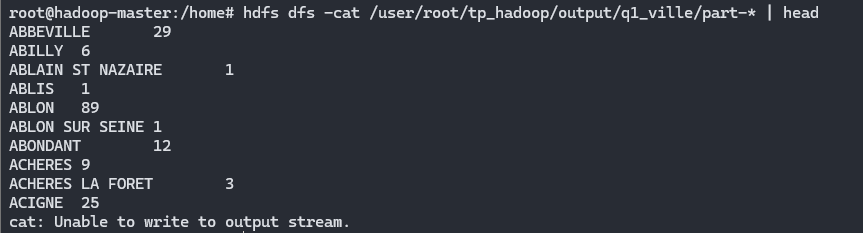

La sortie MapReduce est triée par nom de ville.

Pour répondre directement à la question, j'ai trié les résultats par quantité décroissante.

Comme les colonnes sont séparées par une tabulation, je précise `\t` comme séparateur afin que les villes contenant plusieurs mots, comme `LE MANS`, soient correctement prises en compte.

```bash
hdfs dfs -cat /user/root/tp_hadoop/output/q1_ville/part-* | sort -t$'\t' -k2,2nr | head -10
```

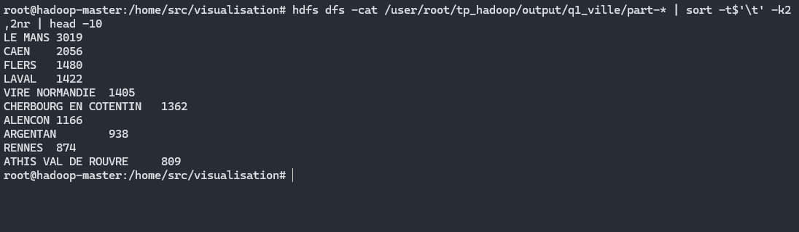

Le classement montre que `LE MANS` arrive en première position avec :

```text
LE MANS = 3019
```

C'est donc la ville qui commande le plus d'articles dans le fichier étudié.

---

## 6. Script job.sh

J'ai également ajouté un `job.sh` pour éviter de retaper toutes les commandes à chaque lancement.

```bash
#!/bin/bash

INPUT="/user/root/tp_hadoop/input/dataw_fro03.csv"
OUTPUT="/user/root/tp_hadoop/output/q1_ville"

# Suppression de l'ancienne sortie
hdfs dfs -rm -r -f "$OUTPUT"

# Lancement du job
hadoop jar $HADOOP_HOME/share/hadoop/tools/lib/hadoop-streaming-*.jar \
-file mapper.py -mapper "python3 mapper.py" \
-file reducer.py -reducer "python3 reducer.py" \
-input "$INPUT" \
-output "$OUTPUT"

echo ""
echo "Premières lignes du résultat :"
hdfs dfs -cat ${OUTPUT}/part-* | head

echo ""
echo "Top 10 des villes :"
hdfs dfs -cat ${OUTPUT}/part-* | sort -t$'\t' -k2,2nr | head -10
```

---

# Q2 - Quelle ville#année commande le plus d'articles ?

Pour la deuxième question, le principe est presque le même.

Cette fois, la clé utilisée par MapReduce contient :

```text
ville#année
```

Par exemple :

```text
LE MANS#2004
CAEN#2005
```

J'ai créé :

```text
src/mapreduce/q2_ville_annee/
```

avec :

```text
mapper.py
reducer.py
job.sh
```

---

## 1. Mapper

Le mapper récupère :

- la ville
- l'année de la commande
- la quantité

```python
import sys
import csv

# Lecture du CSV depuis l'entrée standard
reader = csv.reader(sys.stdin)

for row in reader:
    # On ignore l'en-tête et les lignes trop courtes
    if len(row) < 16 or row[0] == "codcli":
        continue

    ville = row[5]
    date_commande = row[7]

    try:
        # qte est la colonne d'index 15
        qte = int(float(row[15]))

        # La date commence par l'année
        annee = date_commande[:4]

        # Vérification que l'année est valide
        int(annee)

    except ValueError:
        continue

    # Clé : ville#année
    print(f"{ville}#{annee}\t{qte}")
```

La sortie ressemble donc à :

```text
LE MANS#2004    2
LE MANS#2004    1
CAEN#2005       3
```

---

## 2. Reducer

Le reducer additionne les quantités pour chaque combinaison ville#année.

```python
import sys

current_key = None
total = 0

for line in sys.stdin:
    line = line.strip()

    if not line:
        continue

    try:
        # Chaque ligne contient : ville#année + quantité
        key, qte = line.split("\t", 1)
        qte = int(qte)
    except ValueError:
        continue

    # Même clé : on additionne
    if key == current_key:
        total += qte

    else:
        # Quand la clé change, on affiche le total précédent
        if current_key is not None:
            print(f"{current_key}\t{total}")

        current_key = key
        total = qte

# Affichage de la dernière clé
if current_key is not None:
    print(f"{current_key}\t{total}")
```

---

## 3. Test local

J'ai d'abord testé le traitement localement :

```powershell
Get-Content .\data\raw\dataw_fro03.csv | python .\src\mapreduce\q2_ville_annee\mapper.py | Sort-Object | python .\src\mapreduce\q2_ville_annee\reducer.py | Select-Object -First 10
```

Le test fonctionne correctement avant le lancement sur Hadoop.

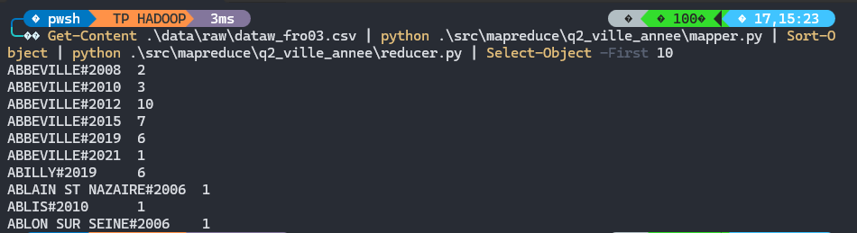

---

## 4. Lancement sur Hadoop

J'ai copié les scripts dans le master :

```powershell
docker cp .\src\mapreduce\q2_ville_annee\mapper.py hadoop-master:/home/mapper_q2.py
docker cp .\src\mapreduce\q2_ville_annee\reducer.py hadoop-master:/home/reducer_q2.py
```

Puis j'ai lancé le job :

```bash
hadoop jar $HADOOP_HOME/share/hadoop/tools/lib/hadoop-streaming-*.jar \
-file /home/mapper_q2.py -mapper "python3 mapper_q2.py" \
-file /home/reducer_q2.py -reducer "python3 reducer_q2.py" \
-input /user/root/tp_hadoop/input/dataw_fro03.csv \
-output /user/root/tp_hadoop/output/q2_ville_annee
```

Le job se termine correctement avec :

```text
map 100%
reduce 100%
```

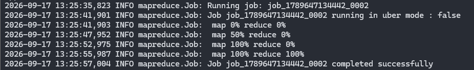

---

## 5. Vérification de la sortie

J'ai vérifié les fichiers générés :

```bash
hdfs dfs -ls /user/root/tp_hadoop/output/q2_ville_annee
```

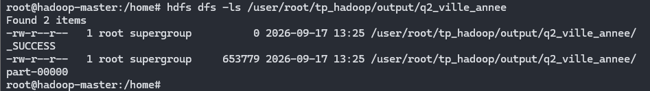

Puis les premières lignes :

```bash
hdfs dfs -cat /user/root/tp_hadoop/output/q2_ville_annee/part-* | head
```

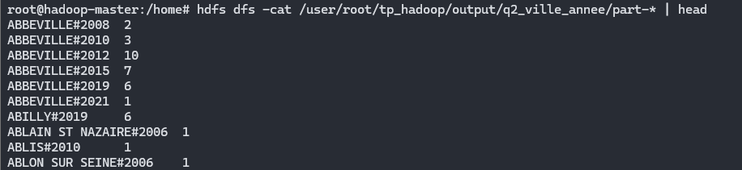

Pour trouver directement les plus gros totaux, j'ai trié les résultats sur la deuxième colonne.

Comme pour Q1, j'utilise la tabulation comme séparateur afin que les villes contenant plusieurs mots soient correctement interprétées.

```bash
hdfs dfs -cat /user/root/tp_hadoop/output/q2_ville_annee/part-* | sort -t$'\t' -k2,2nr | head -10
```

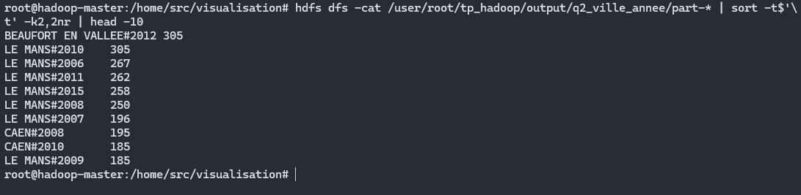

Le classement montre que deux combinaisons arrivent en tête avec le même total :

```text
BEAUFORT EN VALLEE#2012 = 305
LE MANS#2010 = 305
```

Il y a donc une égalité pour la première place avec 305 articles commandés.

---

## 6. Script job.sh

Comme pour Q1, j'ai ajouté un script pour automatiser le lancement.

```bash
#!/bin/bash

INPUT="/user/root/tp_hadoop/input/dataw_fro03.csv"
OUTPUT="/user/root/tp_hadoop/output/q2_ville_annee"

# Suppression de l'ancienne sortie
hdfs dfs -rm -r -f "$OUTPUT"

# Lancement du job
hadoop jar $HADOOP_HOME/share/hadoop/tools/lib/hadoop-streaming-*.jar \
-file mapper.py -mapper "python3 mapper.py" \
-file reducer.py -reducer "python3 reducer.py" \
-input "$INPUT" \
-output "$OUTPUT"

echo ""
echo "Premières lignes du résultat :"
hdfs dfs -cat ${OUTPUT}/part-* | head

echo ""
echo "Top 10 ville#année :"
hdfs dfs -cat ${OUTPUT}/part-* | sort -t$'\t' -k2,2nr | head -10
```

---

# Vérification dans l'interface HDFS

J'ai également vérifié les résultats depuis l'interface Web du NameNode.

Dans :

```text
/user/root/tp_hadoop/output
```

on retrouve bien les deux dossiers créés par les jobs :

```text
q1_ville
q2_ville_annee
```

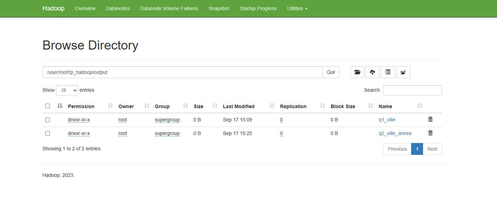

Cela confirme que les deux traitements ont bien écrit leurs résultats dans HDFS.

---

## Conclusion

Les deux traitements MapReduce ont été exécutés correctement.

Pour Q1, la clé utilisée est simplement la ville :

```text
ville - somme des quantités
```

Le classement obtenu montre que `LE MANS` arrive en tête avec 3019 articles commandés.

Pour Q2, la clé contient la ville et l'année :

```text
ville#année - somme des quantités
```

Deux combinaisons arrivent en tête avec 305 articles :

```text
BEAUFORT EN VALLEE#2012
LE MANS#2010
```

Le fonctionnement reste le même dans les deux cas :

```text
CSV
- Mapper
- Shuffle / Sort
- Reducer
- Résultat dans HDFS
```

Les résultats sont stockés dans :

```text
/user/root/tp_hadoop/output/q1_ville
/user/root/tp_hadoop/output/q2_ville_annee
```