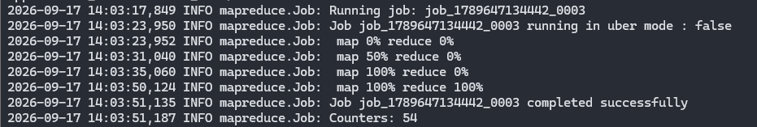
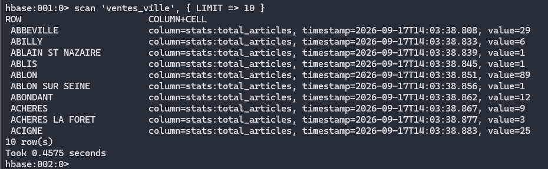
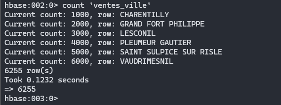
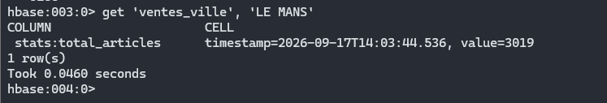

# 03 - HBase

## Objectif

Dans cette partie, je reprends le résultat de la Q1 mais au lieu de garder uniquement la sortie MapReduce dans HDFS, j'enregistre aussi les résultats dans HBase.

La rowkey utilisée est la ville.

Chaque ville contient ensuite le total d'articles commandés.

---

## 1. Création de la table HBase

Je me suis connecté au shell HBase :

```bash
hbase shell
```

Puis j'ai créé la table :

```ruby
create 'ventes_ville', 'stats'
```

La structure utilisée est simple :

```text
rowkey = ville
stats:total_articles = total des articles commandés
```

J'ai vérifié que la table existait avec :

```ruby
list
```

---

## 2. Mapper

Le mapper est basé sur celui utilisé pour la Q1.

Il récupère la ville et la quantité commandée.

```python
import sys
import csv

# Lecture du CSV ligne par ligne
reader = csv.reader(sys.stdin)

for row in reader:
    # On ignore l'en-tête et les lignes trop courtes
    if len(row) < 16 or row[0] == "codcli":
        continue

    ville = row[5]

    try:
        # Quantité commandée
        qte = int(float(row[15]))
    except ValueError:
        continue

    # Envoi de la ville et de la quantité au reducer
    print(f"{ville}\t{qte}")
```

La sortie du mapper reste de la forme :

```text
LE MANS    2
LE MANS    1
CAEN       3
```

---

## 3. Reducer avec HappyBase

Le reducer additionne les quantités comme pour Q1.

La différence est qu'il écrit ensuite chaque résultat dans HBase avec HappyBase.

```python
import sys
import happybase

# Connexion au serveur Thrift HBase du master
connection = happybase.Connection("hadoop-master", 9090)

# Table dans laquelle les résultats seront enregistrés
table = connection.table("ventes_ville")

current_ville = None
total = 0


def save_ville(ville, total_articles):
    # La ville devient la rowkey
    table.put(
        ville.encode("utf-8"),
        {
            b"stats:total_articles": str(total_articles).encode("utf-8")
        }
    )

    # On garde aussi une sortie MapReduce classique
    print(f"{ville}\t{total_articles}")


for line in sys.stdin:
    line = line.strip()

    if not line:
        continue

    try:
        ville, qte = line.split("\t", 1)
        qte = int(qte)
    except ValueError:
        continue

    # Même ville : on additionne
    if ville == current_ville:
        total += qte

    else:
        # Quand la ville change, on sauvegarde la précédente
        if current_ville is not None:
            save_ville(current_ville, total)

        current_ville = ville
        total = qte


# Enregistrement de la dernière ville
if current_ville is not None:
    save_ville(current_ville, total)


connection.close()
```

Le point important ici est l'appel :

```python
table.put(...)
```

qui permet d'écrire directement dans HBase.

---

## 4. Lancement du job

Avant de lancer le traitement, j'ai vérifié que Thrift était bien démarré :

```bash
jps | grep Thrift
```

Le processus `ThriftServer` était bien présent.

J'ai ensuite lancé le job avec mon script :

```bash
cd /home/src/hbase/q3_ville
chmod +x job.sh
./job.sh
```

Le script utilisé est :

```bash
#!/bin/bash

INPUT="/user/root/tp_hadoop/input/dataw_fro03.csv"
OUTPUT="/user/root/tp_hadoop/output/q3_hbase"

# Suppression de l'ancienne sortie Hadoop
hdfs dfs -rm -r -f "$OUTPUT"

# Lancement du job
hadoop jar $HADOOP_HOME/share/hadoop/tools/lib/hadoop-streaming-*.jar \
-file mapper.py -mapper "python3 mapper.py" \
-file reducer_hbase.py -reducer "python3 reducer_hbase.py" \
-input "$INPUT" \
-output "$OUTPUT"
```

Le job s'est terminé correctement avec :

```text
map 100%
reduce 100%
```



---

## 5. Vérification dans HBase

Après le job, je suis retourné dans le shell HBase :

```bash
hbase shell
```

J'ai affiché quelques lignes :

```ruby
scan 'ventes_ville', { LIMIT => 10 }
```



Cela permet de voir que les villes sont bien utilisées comme rowkeys et que chaque ligne contient :

```text
stats:total_articles
```

---

## 6. Nombre de villes stockées

J'ai utilisé :

```ruby
count 'ventes_ville'
```

Le résultat obtenu est :

```text
6255
```

La table contient donc 6255 villes.



---

## 7. Vérification de LE MANS

Le sujet demande aussi de relever la valeur de `LE MANS`.

J'ai utilisé :

```ruby
get 'ventes_ville', 'LE MANS'
```

Le résultat obtenu est :

```text
stats:total_articles = 3019
```



On retrouve bien le même total que dans la Q1 MapReduce.

Cela permet de vérifier que les résultats stockés dans HBase sont cohérents avec ceux calculés précédemment.

---

## Conclusion

Le job MapReduce calcule les quantités par ville puis les écrit directement dans HBase avec HappyBase.

La table créée est :

```text
ventes_ville
```

avec :

```text
rowkey = ville
stats:total_articles = total commandé
```

La table contient :

```text
6255 lignes
```

et pour `LE MANS` :

```text
3019 articles
```

Le résultat est cohérent avec la Q1 MapReduce.