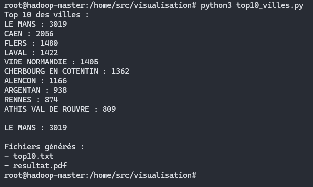
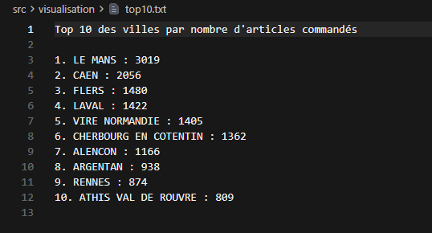
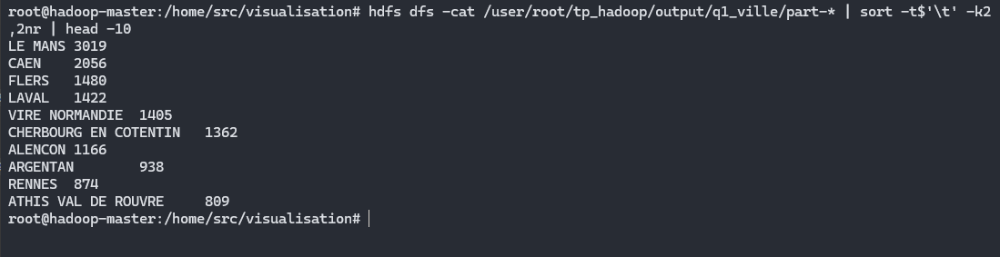
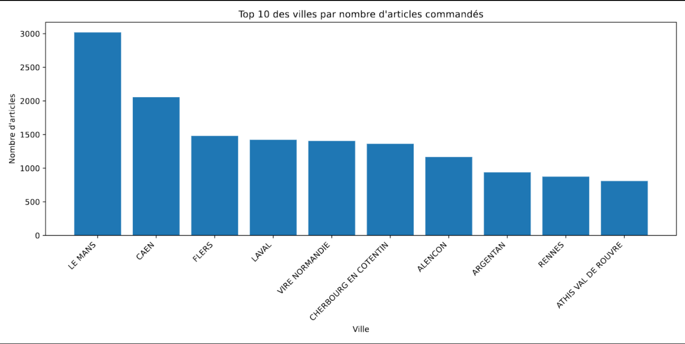

# 04 - Visualisation

## Objectif

Dans cette partie, je récupère les données enregistrées dans HBase afin de produire un classement des villes qui commandent le plus d'articles.

Le but est de :

- lire les données HBase avec HappyBase
- récupérer les 10 villes avec le plus grand nombre d'articles commandés
- générer un fichier `top10.txt`
- générer un graphique avec Matplotlib dans `resultat.pdf`
- comparer les résultats avec ceux obtenus précédemment avec MapReduce
- récupérer les fichiers de résultat sur la machine hôte

---

## 1. Lecture des données HBase

Les données utilisées sont celles de la table créée dans la partie précédente :

```text
ventes_ville
```

Chaque ligne contient :

```text
rowkey = ville
stats:total_articles = total d'articles commandés
```

Pour lire cette table depuis Python, j'utilise HappyBase qui communique avec HBase grâce au serveur Thrift.

Avant de lancer le script, j'ai vérifié que les dépendances étaient disponibles :

```bash
python3 -c "import happybase; print('HappyBase OK')"
python3 -c "import matplotlib; print('Matplotlib OK')"
```

---

## 2. Script Python

J'ai créé le fichier :

```text
src/visualisation/top10_villes.py
```

Le script lit toutes les villes présentes dans HBase, trie les résultats par nombre d'articles décroissant et conserve les 10 premières.

```python
import happybase
import matplotlib.pyplot as plt

# Connexion à HBase via Thrift
connection = happybase.Connection("hadoop-master", 9090)

table = connection.table("ventes_ville")

resultats = []

# Lecture de toutes les villes de la table HBase
for row_key, data in table.scan():
    ville = row_key.decode("utf-8")

    total = int(
        data[b"stats:total_articles"].decode("utf-8")
    )

    resultats.append((ville, total))

connection.close()

# Tri par nombre d'articles décroissant
resultats.sort(key=lambda x: x[1], reverse=True)

# On garde seulement les 10 premières villes
top10 = resultats[:10]

print("Top 10 des villes :")

for ville, total in top10:
    print(f"{ville} : {total}")

# Vérification de LE MANS
for ville, total in resultats:
    if ville == "LE MANS":
        print(f"\nLE MANS : {total}")
        break

# Création du fichier texte
with open("top10.txt", "w", encoding="utf-8") as fichier:
    fichier.write("Top 10 des villes par nombre d'articles commandés\n\n")

    for position, (ville, total) in enumerate(top10, start=1):
        fichier.write(f"{position}. {ville} : {total}\n")

# Préparation des données du graphique
villes = [ville for ville, total in top10]
totaux = [total for ville, total in top10]

# Création du graphique
plt.figure(figsize=(12, 6))

plt.bar(villes, totaux)

plt.title("Top 10 des villes par nombre d'articles commandés")
plt.xlabel("Ville")
plt.ylabel("Nombre d'articles")

plt.xticks(rotation=45, ha="right")

plt.tight_layout()

# Export au format PDF
plt.savefig("resultat.pdf")

print("\nFichiers générés :")
print("- top10.txt")
print("- resultat.pdf")
```

Le fonctionnement est donc :

```text
HBase
- HappyBase
- lecture des villes
- tri décroissant
- Top 10
- top10.txt
- resultat.pdf
```

---

## 3. Exécution du script

Depuis le conteneur master, je me suis placé dans :

```bash
cd /home/src/visualisation
```

Puis j'ai lancé :

```bash
python3 top10_villes.py
```

Le script affiche directement le classement dans le terminal et génère les deux fichiers demandés.



---

## 4. Résultat du Top 10

Le fichier généré est :

```text
top10.txt
```

Je l'ai affiché avec :

```bash
cat top10.txt
```

Le résultat obtenu est :

```text
Top 10 des villes par nombre d'articles commandés

1. LE MANS : 3019
2. CAEN : 2056
3. FLERS : 1480
4. LAVAL : 1422
5. VIRE NORMANDIE : 1405
6. CHERBOURG EN COTENTIN : 1362
7. ALENCON : 1166
8. ARGENTAN : 938
9. RENNES : 874
10. ATHIS VAL DE ROUVRE : 809
```



On retrouve bien `LE MANS` en première position avec :

```text
3019 articles
```

---

## 5. Comparaison avec MapReduce

Afin de vérifier que les valeurs obtenues depuis HBase sont correctes, j'ai comparé le classement avec celui obtenu précédemment avec MapReduce.

La commande utilisée est :

```bash
hdfs dfs -cat /user/root/tp_hadoop/output/q1_ville/part-* | sort -t$'\t' -k2,2nr | head -10
```

Le séparateur utilisé est explicitement la tabulation avec :

```text
-t$'\t'
```

Cela évite les problèmes avec les villes contenant plusieurs mots comme `LE MANS` ou `VIRE NORMANDIE`.



Le classement MapReduce et le classement lu depuis HBase sont identiques.

On retrouve notamment :

```text
LE MANS = 3019
CAEN = 2056
FLERS = 1480
LAVAL = 1422
```

Cela permet de vérifier la cohérence entre les différentes étapes du TP.

---

## 6. Génération du graphique

Le script Python utilise Matplotlib pour représenter les 10 villes sous forme de graphique en barres.

Le fichier généré est :

```text
resultat.pdf
```

Le graphique présente :

```text
axe X = villes
axe Y = nombre d'articles commandés
```



Le graphique permet de voir rapidement que `LE MANS` arrive largement en première position devant les autres villes.

---

## 7. Récupération du fichier part-00000

Le résultat MapReduce Q1 est stocké dans HDFS.

Pour pouvoir le récupérer sur la machine Windows, je l'ai d'abord copié depuis HDFS vers le système de fichiers du conteneur.

J'ai créé un dossier temporaire :

```bash
mkdir -p /home/export
```

Puis j'ai utilisé :

```bash
hdfs dfs -get -f /user/root/tp_hadoop/output/q1_ville/part-00000 /home/export/part-00000
```

Le fichier se trouve alors dans :

```text
/home/export/part-00000
```

dans le conteneur `hadoop-master`.

Depuis PowerShell sur Windows, je l'ai ensuite copié dans mon projet :

```powershell
docker cp hadoop-master:/home/export/part-00000 .\results\visualisation\part-00000
```

Le transfert se fait donc en deux étapes :

```text
HDFS
/user/root/tp_hadoop/output/q1_ville/part-00000

        ↓ hdfs dfs -get

Conteneur
/home/export/part-00000

        ↓ docker cp

Machine Windows
results/visualisation/part-00000
```

---

## 8. Récupération des fichiers générés

J'ai également récupéré les fichiers générés par le script Python sur la machine hôte.

Pour le PDF :

```powershell
docker cp hadoop-master:/home/src/visualisation/resultat.pdf .\results\visualisation\resultat.pdf
```

Pour le fichier texte :

```powershell
docker cp hadoop-master:/home/src/visualisation/top10.txt .\results\visualisation\top10.txt
```

Le dossier final contient donc :

```text
results/
└── visualisation/
    ├── part-00000
    ├── top10.txt
    └── resultat.pdf
```

---

## Conclusion

Cette partie permet de réutiliser les données stockées dans HBase pour produire une restitution plus lisible.

HappyBase permet de lire les données de la table `ventes_ville`, puis Python trie les villes selon le nombre total d'articles commandés.

Le résultat obtenu montre que :

```text
LE MANS = 3019 articles
```

est la ville avec le plus grand nombre d'articles commandés.

Les résultats obtenus avec HBase sont identiques à ceux de MapReduce, ce qui permet de vérifier la cohérence du traitement.

Les résultats finaux de cette partie sont :

```text
part-00000
top10.txt
resultat.pdf
```

et ils ont été récupérés sur la machine hôte dans :

```text
results/visualisation/
```