# 05 - Hive

## Objectif

Dans cette partie, j'utilise Hive pour refaire les analyses réalisées précédemment avec MapReduce.

Le but est de :

- préparer un fichier TSV contenant uniquement les colonnes utiles
- déposer ce fichier dans HDFS
- créer une base Hive
- créer une table externe
- refaire le classement des villes de la Q1
- refaire le classement ville#année de la Q2
- comparer les résultats avec MapReduce
- utiliser `EXPLAIN` pour voir le plan d'exécution
- vérifier quel moteur est utilisé par Hive

---

## 1. Préparation du fichier TSV

Le fichier CSV d'origine contient beaucoup de colonnes.

Pour les analyses Hive, j'ai uniquement besoin de :

```text
villecli
datcde
qte
```

J'ai donc créé le script :

```text
src/hive/prepare_tsv.py
```

Le script produit un fichier TSV sans en-tête.

```python
import csv

input_file = "data/raw/dataw_fro03.csv"
output_file = "results/hive/ventes_hive.tsv"

with open(input_file, "r", encoding="utf-8") as source:
    reader = csv.reader(source)

    with open(output_file, "w", encoding="utf-8", newline="") as destination:
        writer = csv.writer(destination, delimiter="\t")

        for row in reader:
            # On ignore l'en-tête et les lignes trop courtes
            if len(row) < 16 or row[0] == "codcli":
                continue

            ville = row[5]
            date_commande = row[7]

            try:
                qte = int(float(row[15]))
            except ValueError:
                continue

            # Pas d'en-tête dans le TSV
            writer.writerow([ville, date_commande, qte])
```

Le script est lancé depuis la racine du projet :

```powershell
python .\src\hive\prepare_tsv.py
```

Puis j'ai vérifié les premières lignes :

```powershell
Get-Content .\results\hive\ventes_hive.tsv | Select-Object -First 10
```

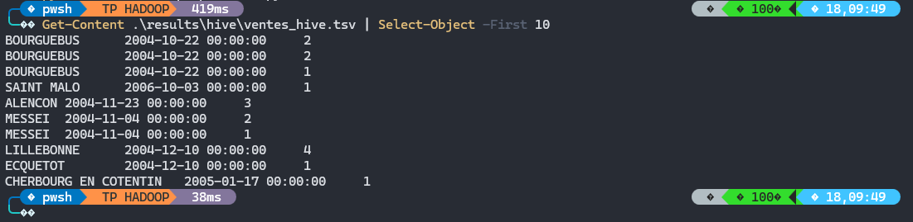

---

## 2. Dépôt du TSV dans HDFS

J'ai d'abord copié le fichier dans le conteneur master :

```powershell
docker cp .\results\hive\ventes_hive.tsv hadoop-master:/home/ventes_hive.tsv
```

Puis j'ai créé un dossier HDFS dédié à Hive :

```bash
hdfs dfs -mkdir -p /user/root/tp_hadoop/hive/ventes
```

Le fichier TSV est ensuite déposé dans ce dossier :

```bash
hdfs dfs -put -f /home/ventes_hive.tsv /user/root/tp_hadoop/hive/ventes/
```

J'ai vérifié sa présence :

```bash
hdfs dfs -ls -h /user/root/tp_hadoop/hive/ventes
```

et affiché ses premières lignes :

```bash
hdfs dfs -cat /user/root/tp_hadoop/hive/ventes/ventes_hive.tsv | head
```

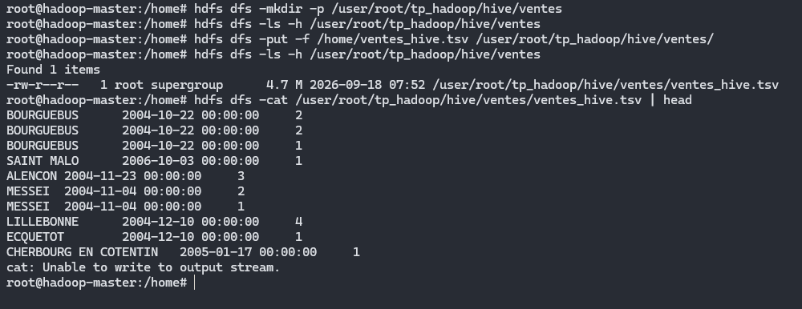

Les données utilisées par Hive sont donc stockées dans :

```text
/user/root/tp_hadoop/hive/ventes
```

---

## 3. Connexion à Hive

Pour utiliser Hive, je me suis connecté à HiveServer2 avec Beeline :

```bash
beeline -u jdbc:hive2://localhost:10000/default
```

J'ai ensuite créé une base dédiée au TP :

```sql
CREATE DATABASE IF NOT EXISTS tp_hadoop;
```

Puis :

```sql
USE tp_hadoop;
```

---

## 4. Création de la table externe

J'ai créé une table externe Hive :

```sql
CREATE EXTERNAL TABLE IF NOT EXISTS ventes (
    ville STRING,
    date_commande STRING,
    qte INT
)
ROW FORMAT DELIMITED
FIELDS TERMINATED BY '\t'
STORED AS TEXTFILE
LOCATION '/user/root/tp_hadoop/hive/ventes';
```

La table possède donc trois colonnes :

```text
ville
date_commande
qte
```

J'utilise une table `EXTERNAL` car les fichiers sont déjà présents dans HDFS.

Hive utilise donc les fichiers du dossier :

```text
/user/root/tp_hadoop/hive/ventes
```

sans avoir besoin de déplacer les données.

---

## 5. Vérification de la table

J'ai vérifié la présence de la table :

```sql
SHOW TABLES;
```

Puis sa structure :

```sql
DESCRIBE ventes;
```

J'ai ensuite affiché quelques lignes :

```sql
SELECT * FROM ventes LIMIT 10;
```

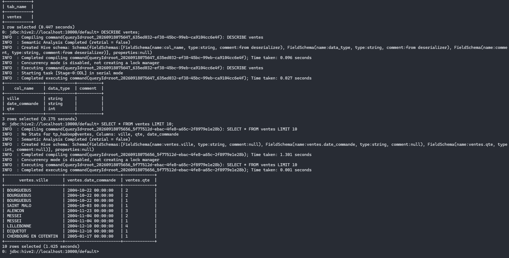

---

## 6. Nombre de lignes initial

Avant la partie NiFi, j'ai également compté le nombre de lignes présentes dans la table :

```sql
SELECT COUNT(*) FROM ventes;
```

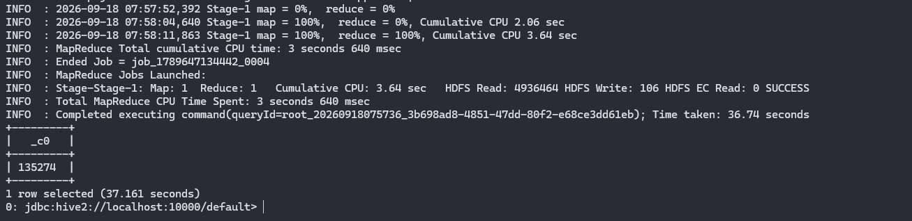

Je conserve cette valeur car elle servira plus tard à vérifier que l'ajout de nouvelles données avec NiFi augmente bien le nombre de lignes visibles dans Hive.

---

# Q1 - Classement des villes avec Hive

## 7. Requête Hive

Pour refaire la première analyse MapReduce, j'ai utilisé :

```sql
SELECT
    ville,
    SUM(qte) AS total_articles
FROM ventes
GROUP BY ville
ORDER BY total_articles DESC
LIMIT 10;
```

Cette requête :

```text
regroupe les lignes par ville
- additionne les quantités
- trie les résultats par ordre décroissant
- garde les 10 premières villes
```

Le résultat obtenu commence par :

```text
LE MANS                  3019
CAEN                     2056
FLERS                    1480
LAVAL                    1422
VIRE NORMANDIE           1405
CHERBOURG EN COTENTIN    1362
ALENCON                   1166
ARGENTAN                   938
RENNES                     874
ATHIS VAL DE ROUVRE        809
```

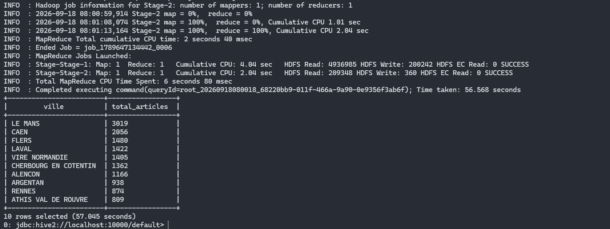

---

## 8. Comparaison avec MapReduce

Pour comparer avec la Q1 MapReduce, j'ai utilisé :

```bash
hdfs dfs -cat /user/root/tp_hadoop/output/q1_ville/part-* | sort -t$'\t' -k2,2nr | head -10
```

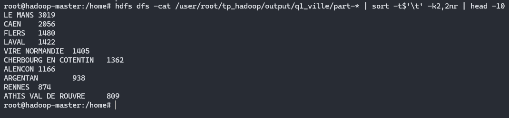

Les deux méthodes donnent le même résultat.

On retrouve notamment :

```text
LE MANS = 3019
CAEN = 2056
FLERS = 1480
LAVAL = 1422
```

Le résultat Hive est donc cohérent avec celui du job MapReduce.

---

# Q2 - Classement ville#année avec Hive

## 9. Requête Hive

Pour reproduire la deuxième analyse MapReduce, j'ai récupéré l'année depuis la date de commande avec :

```sql
SUBSTR(date_commande, 1, 4)
```

La requête complète est :

```sql
SELECT
    CONCAT(ville, '#', SUBSTR(date_commande, 1, 4)) AS ville_annee,
    SUM(qte) AS total_articles
FROM ventes
GROUP BY
    ville,
    SUBSTR(date_commande, 1, 4)
ORDER BY total_articles DESC
LIMIT 10;
```

Le résultat obtenu commence par :

```text
BEAUFORT EN VALLEE#2012    305
LE MANS#2010               305
LE MANS#2006               267
LE MANS#2011               262
LE MANS#2015               258
LE MANS#2008               250
LE MANS#2007               196
CAEN#2008                  195
CAEN#2010                  185
LE MANS#2009               185
```

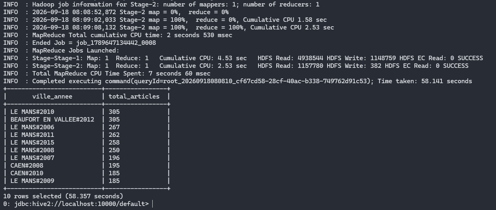

Comme pour MapReduce, deux combinaisons arrivent donc en tête avec le même total :

```text
BEAUFORT EN VALLEE#2012 = 305
LE MANS#2010 = 305
```

---

## 10. Comparaison avec MapReduce

Pour vérifier le résultat avec Q2 MapReduce :

```bash
hdfs dfs -cat /user/root/tp_hadoop/output/q2_ville_annee/part-* | sort -t$'\t' -k2,2nr | head -10
```

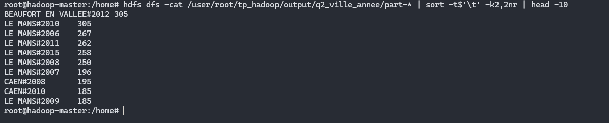

Les résultats obtenus avec Hive correspondent à ceux obtenus précédemment avec MapReduce.

---

# Plan d'exécution Hive

## 11. Vérification du moteur d'exécution

J'ai vérifié le moteur utilisé par Hive avec :

```sql
SET hive.execution.engine;
```

Le résultat obtenu est :

```text
hive.execution.engine=mr
```

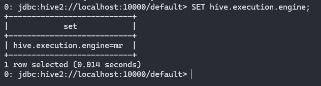

`mr` correspond à MapReduce.

Dans cet environnement, Hive utilise donc MapReduce comme moteur pour exécuter les traitements.

Cela permet de comprendre la différence entre Hive et MapReduce :

```text
Hive
- permet d'écrire les traitements en SQL
- construit un plan d'exécution
- transmet le calcul au moteur MapReduce

MapReduce
- réalise réellement le traitement distribué

HDFS
- stocke les fichiers utilisés par Hive
```

---

## 12. EXPLAIN de la Q1

J'ai utilisé `EXPLAIN` pour voir comment Hive prévoit d'exécuter la requête.

```sql
EXPLAIN
SELECT
    ville,
    SUM(qte) AS total_articles
FROM ventes
GROUP BY ville
ORDER BY total_articles DESC
LIMIT 10;
```

Hive affiche alors le plan d'exécution de la requête.

On retrouve notamment les différentes étapes nécessaires pour :

```text
lire la table
- regrouper les données
- calculer les sommes
- transférer les données entre les étapes
- trier le résultat
- produire la sortie
```

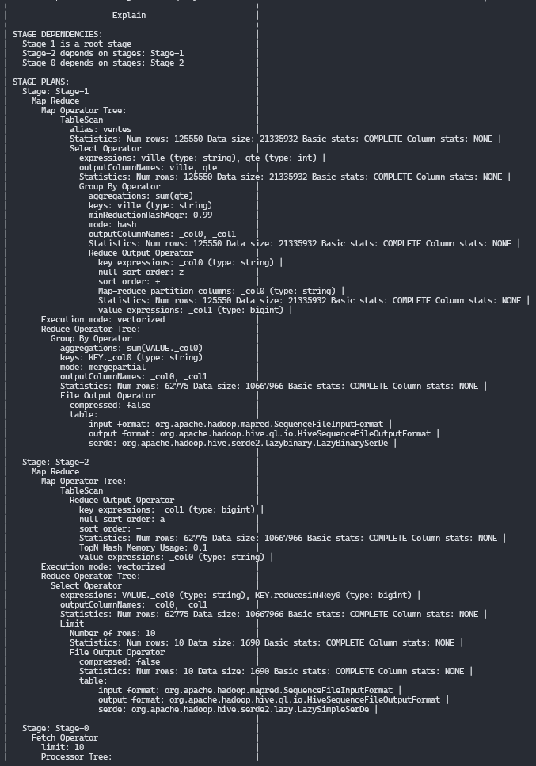

---

## 13. EXPLAIN de la Q2

J'ai également affiché le plan de la deuxième requête :

```sql
EXPLAIN
SELECT
    CONCAT(ville, '#', SUBSTR(date_commande, 1, 4)) AS ville_annee,
    SUM(qte) AS total_articles
FROM ventes
GROUP BY
    ville,
    SUBSTR(date_commande, 1, 4)
ORDER BY total_articles DESC
LIMIT 10;
```

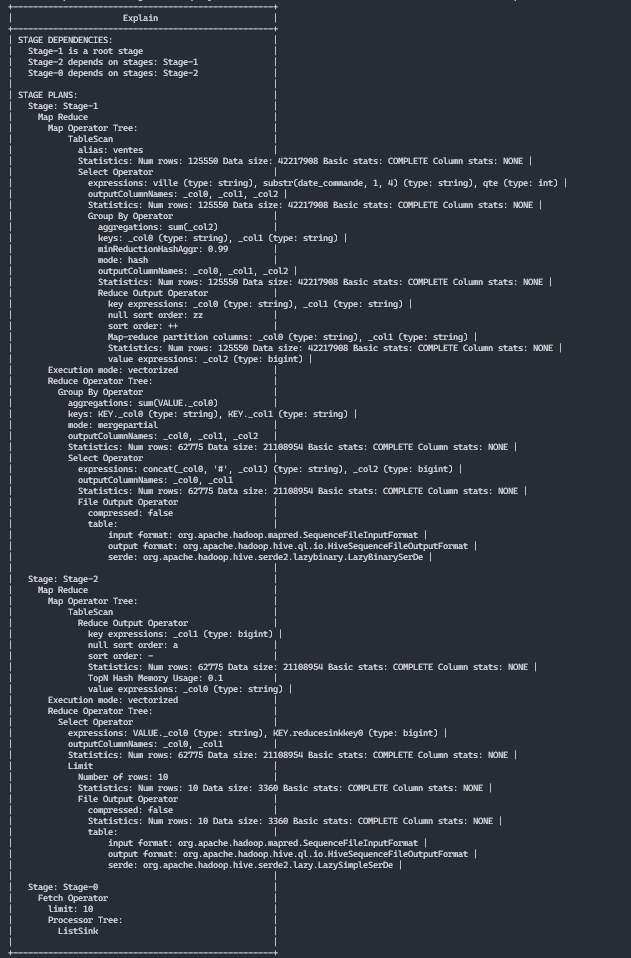

L'utilisation de `EXPLAIN` permet donc de voir comment une requête SQL Hive est transformée en différentes opérations avant son exécution.

---

## 14. Fichier queries.sql

Pour conserver les principales requêtes utilisées dans cette partie, j'ai créé :

```text
src/hive/queries.sql
```

Le fichier contient :

```sql
USE tp_hadoop;

-- Vérification du moteur Hive
SET hive.execution.engine;

-- Q1 : classement des villes
SELECT
    ville,
    SUM(qte) AS total_articles
FROM ventes
GROUP BY ville
ORDER BY total_articles DESC
LIMIT 10;

-- Q2 : classement ville#année
SELECT
    CONCAT(ville, '#', SUBSTR(date_commande, 1, 4)) AS ville_annee,
    SUM(qte) AS total_articles
FROM ventes
GROUP BY
    ville,
    SUBSTR(date_commande, 1, 4)
ORDER BY total_articles DESC
LIMIT 10;

-- Plan d'exécution Q1
EXPLAIN
SELECT
    ville,
    SUM(qte) AS total_articles
FROM ventes
GROUP BY ville
ORDER BY total_articles DESC
LIMIT 10;

-- Plan d'exécution Q2
EXPLAIN
SELECT
    CONCAT(ville, '#', SUBSTR(date_commande, 1, 4)) AS ville_annee,
    SUM(qte) AS total_articles
FROM ventes
GROUP BY
    ville,
    SUBSTR(date_commande, 1, 4)
ORDER BY total_articles DESC
LIMIT 10;
```

---

## Conclusion

Hive permet de travailler sur les fichiers stockés dans HDFS avec des requêtes SQL.

La table externe `ventes` pointe directement vers :

```text
/user/root/tp_hadoop/hive/ventes
```

Les deux analyses réalisées avec Hive donnent les mêmes résultats que les jobs MapReduce :

```text
Q1
LE MANS = 3019 articles

Q2
BEAUFORT EN VALLEE#2012 = 305
LE MANS#2010 = 305
```

La commande :

```sql
SET hive.execution.engine;
```

retourne :

```text
hive.execution.engine=mr
```

Dans cet environnement, les requêtes Hive sont donc exécutées avec le moteur MapReduce.

On peut résumer le fonctionnement de cette partie ainsi :

```text
TSV
- HDFS
- Table externe Hive
- Requête SQL
- Plan d'exécution Hive
- MapReduce
- Résultat
```