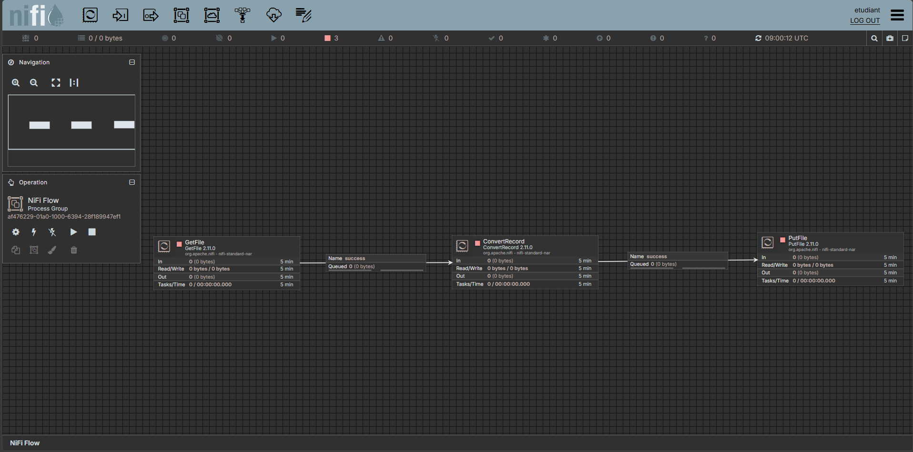
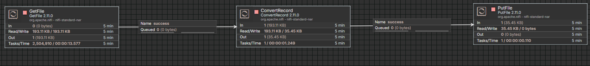
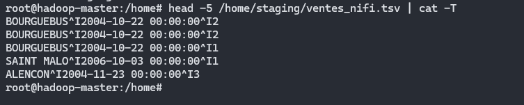
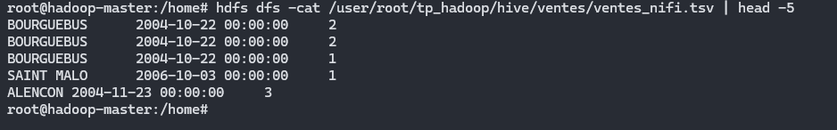
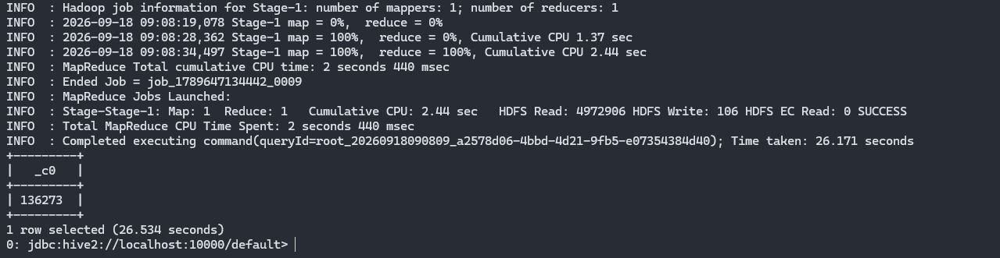
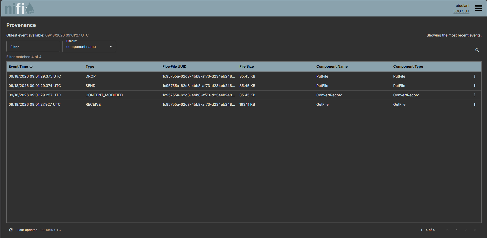
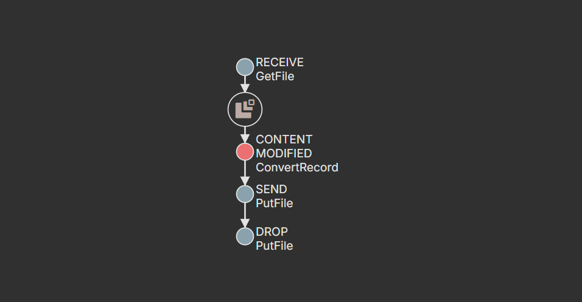

# 06 - NiFi

## Objectif

Dans cette partie, j'utilise NiFi pour automatiser l'ingestion d'un mini fichier CSV.

Le but est de :

- récupérer un fichier depuis un dossier d'entrée
- convertir le CSV en TSV
- ne garder que les colonnes utiles
- écrire le fichier transformé dans un dossier de sortie
- déposer ensuite ce TSV dans HDFS
- vérifier que Hive prend bien en compte les nouvelles lignes
- tracer le parcours du fichier avec Data Provenance

Le flow utilisé est :

```text
GetFile
   ↓
ConvertRecord
   ↓
PutFile
```

---

## 1. Préparation du mini fichier CSV

Le fichier utilisé pour cette partie est :

```text
data/raw/dataw_fro03_mini_1000.csv
```

Il contient un extrait de 1000 lignes du fichier principal.

J'ai créé les dossiers utilisés par NiFi dans le conteneur :

```bash
mkdir -p /opt/nifi/input
mkdir -p /opt/nifi/output
```

Puis j'ai copié le mini CSV dans le dossier d'entrée :

```powershell
docker cp .\data\raw\dataw_fro03_mini_1000.csv hadoop-nifi:/opt/nifi/input/dataw_fro03_mini_1000.csv
```

J'ai vérifié sa présence avec :

```powershell
docker exec hadoop-nifi ls -lh /opt/nifi/input
```

---

## 2. Connexion à NiFi

L'interface NiFi est accessible sur :

```text
https://localhost:8443/nifi
```

Comme NiFi 2.x demande une authentification, j'ai créé le fichier :

```text
nifi/credentials.env
```

à partir de :

```text
nifi/credentials.env.example
```

Puis j'ai recréé uniquement le conteneur NiFi afin qu'il prenne en compte les identifiants :

```powershell
docker compose up -d --force-recreate nifi
```

---

## 3. Création du processeur GetFile

Le premier processeur du flow est :

```text
GetFile
```

Il permet de récupérer automatiquement un fichier présent dans un dossier.

J'ai configuré :

```text
Input Directory
/opt/nifi/input
```

et :

```text
Keep Source File
false
```

Le fichier est donc consommé une fois qu'il est pris en charge par NiFi.

---

## 4. Création du processeur ConvertRecord

Le deuxième processeur est :

```text
ConvertRecord
```

Il permet de lire le fichier CSV puis de le réécrire dans un autre format.

Le flow devient :

```text
GetFile
   ↓
ConvertRecord
```

La relation utilisée entre les deux processeurs est :

```text
success
```

---

## 5. Configuration du CSVReader

Pour lire le fichier CSV, j'ai créé un Controller Service :

```text
CSVReader
```

La configuration principale est :

```text
Schema Access Strategy
Use String Fields From Header
```

Le fichier CSV possède une ligne d'en-tête contenant les noms des colonnes.

Le reader peut donc utiliser directement cette ligne pour connaître le schéma d'entrée.

Le CSV d'origine possède 25 colonnes, mais seules trois colonnes sont utiles pour Hive :

```text
villecli
datcde
qte
```

---

## 6. Configuration du CSVRecordSetWriter

Pour produire le TSV, j'ai créé un deuxième Controller Service :

```text
CSVRecordSetWriter
```

La configuration utilisée est :

```text
Schema Access Strategy
Use 'Schema Text' Property
```

Le format de sortie est :

```text
Tab-Delimited
```

et la ligne d'en-tête est désactivée :

```text
Include Header Line
false
```

Le schéma de sortie contient uniquement :

```json
{
  "type": "record",
  "name": "vente",
  "fields": [
    {
      "name": "villecli",
      "type": "string"
    },
    {
      "name": "datcde",
      "type": "string"
    },
    {
      "name": "qte",
      "type": "string"
    }
  ]
}
```

Cela permet de passer de :

```text
25 colonnes CSV
```

à :

```text
villecli    datcde    qte
```

dans le fichier TSV final.

---

## 7. Création du processeur PutFile

Le dernier processeur du flow est :

```text
PutFile
```

Il permet d'écrire le fichier transformé dans un dossier.

J'ai configuré :

```text
Directory
/opt/nifi/output
```

et :

```text
Conflict Resolution Strategy
replace
```

Les relations finales de `PutFile` sont automatiquement terminées :

```text
success -> terminate
failure -> terminate
```

Le flow complet est donc :

```text
GetFile
   ↓
ConvertRecord
   ↓
PutFile
```



---

## 8. Exécution du flow

J'ai ensuite démarré les trois processeurs.

NiFi a récupéré le mini CSV depuis :

```text
/opt/nifi/input
```

puis l'a transformé avec `ConvertRecord` avant de l'écrire dans :

```text
/opt/nifi/output
```

Après exécution, les compteurs montrent que les trois processeurs ont bien traité le fichier.



On peut également voir que la taille du fichier passe d'environ :

```text
193 KB
```

à :

```text
35 KB
```

Cela s'explique par le fait que le fichier d'origine possède 25 colonnes alors que le fichier final n'en contient plus que 3.

---

## 9. Vérification de la sortie TSV

J'ai vérifié le fichier créé dans le dossier de sortie :

```powershell
docker exec hadoop-nifi ls -lh /opt/nifi/output
```

Le fichier obtenu est :

```text
dataw_fro03_mini_1000.csv
```

Même si son extension est toujours `.csv`, le contenu a bien été transformé au format TSV.

Pour vérifier les premières lignes :

```powershell
docker exec hadoop-nifi sh -c "head -5 /opt/nifi/output/*"
```

Le résultat ressemble à :

```text
BOURGUEBUS    2004-10-22 00:00:00    2
BOURGUEBUS    2004-10-22 00:00:00    2
BOURGUEBUS    2004-10-22 00:00:00    1
SAINT MALO    2006-10-03 00:00:00    1
ALENCON       2004-11-23 00:00:00    3
```

Le fichier a ensuite été renommé depuis le master :

```bash
mv /home/staging/dataw_fro03_mini_1000.csv /home/staging/ventes_nifi.tsv
```

---

## 10. Vérification des lignes et des tabulations

J'ai compté le nombre de lignes :

```bash
wc -l /home/staging/ventes_nifi.tsv
```

Le résultat obtenu est :

```text
999 /home/staging/ventes_nifi.tsv
```

Le mini CSV contenait une ligne d'en-tête.

Comme le TSV final est généré sans en-tête, il contient donc :

```text
999 lignes de données
```

Pour vérifier que le séparateur est bien une tabulation :

```bash
head -5 /home/staging/ventes_nifi.tsv | cat -T
```

Le résultat affiche :

```text
BOURGUEBUS^I2004-10-22 00:00:00^I2
BOURGUEBUS^I2004-10-22 00:00:00^I2
BOURGUEBUS^I2004-10-22 00:00:00^I1
SAINT MALO^I2006-10-03 00:00:00^I1
ALENCON^I2004-11-23 00:00:00^I3
```

Les caractères :

```text
^I
```

correspondent à des tabulations.



---

## 11. Dépôt du TSV dans HDFS

La sortie de NiFi est montée dans le conteneur master sous :

```text
/home/staging
```

J'ai déplacé le fichier vers le dossier HDFS déjà utilisé par Hive :

```bash
hdfs dfs -moveFromLocal /home/staging/ventes_nifi.tsv /user/root/tp_hadoop/hive/ventes/
```

J'ai ensuite vérifié le contenu du dossier :

```bash
hdfs dfs -ls -h /user/root/tp_hadoop/hive/ventes
```

On retrouve désormais :

```text
ventes_hive.tsv
ventes_nifi.tsv
```

J'ai également affiché quelques lignes :

```bash
hdfs dfs -cat /user/root/tp_hadoop/hive/ventes/ventes_nifi.tsv | head -5
```



---

## 12. Vérification avec Hive

La table Hive `ventes` est une table externe qui pointe vers :

```text
/user/root/tp_hadoop/hive/ventes
```

Comme un nouveau fichier a été ajouté dans ce dossier, Hive le prend automatiquement en compte.

Avant l'ingestion NiFi, le compteur était :

```text
135274
```

J'ai relancé :

```sql
USE tp_hadoop;

SELECT COUNT(*) FROM ventes;
```

Le nouveau résultat est :

```text
136273
```



La différence est :

```text
136273 - 135274 = 999
```

Cela correspond exactement aux 999 lignes du fichier généré par NiFi.

L'ingestion est donc bien prise en compte par Hive.

---

## 13. Data Provenance

NiFi permet de conserver l'historique des traitements effectués sur les FlowFiles.

Dans le menu NiFi, j'ai ouvert :

```text
Data Provenance
```

On retrouve les événements liés au traitement du fichier :

```text
RECEIVE
CONTENT_MODIFIED
SEND
DROP
```

Ils correspondent à :

```text
RECEIVE
-> GetFile récupère le fichier

CONTENT_MODIFIED
-> ConvertRecord transforme le contenu

SEND
-> PutFile écrit le fichier

DROP
-> fin du traitement du FlowFile
```

L'interface permet également de voir :

```text
date et heure
FlowFile UUID
taille du fichier
nom du composant
type du composant
type d'événement
```



---

## 14. Lineage

Depuis Data Provenance, j'ai affiché le lineage du FlowFile.

Cela permet de retracer visuellement son parcours dans le flow :

```text
GetFile
   ↓
ConvertRecord
   ↓
PutFile
```



Le lineage permet donc de savoir :

```text
quoi a été traité
quand
par quel composant
dans quel ordre
```

---

## Conclusion

Cette partie permet de remplacer une transformation manuelle par un flux d'ingestion NiFi.

Le processus réalisé est :

```text
Mini CSV
   ↓
GetFile
   ↓
ConvertRecord
   ↓
TSV à 3 colonnes
   ↓
PutFile
   ↓
HDFS
   ↓
Hive
```

Le fichier de sortie contient :

```text
999 lignes
```

et le compteur Hive passe de :

```text
135274
```

à :

```text
136273
```

soit exactement :

```text
+999 lignes
```

Data Provenance et le lineage permettent enfin de retracer tout le parcours du fichier dans NiFi.